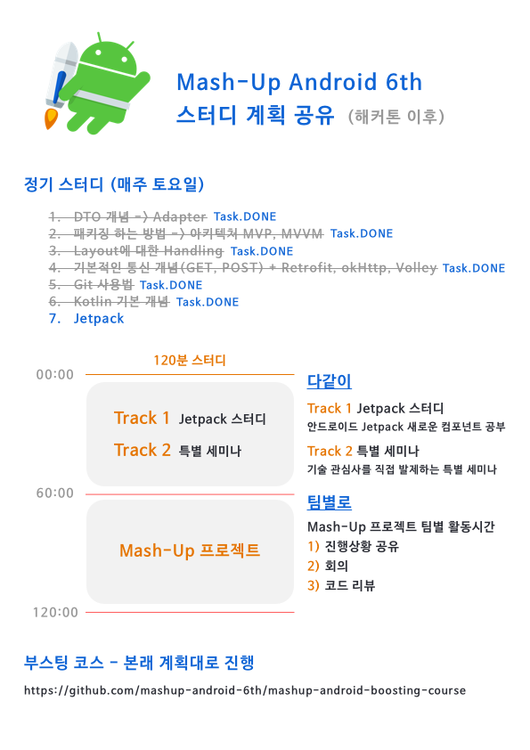

# 안드로이드 스터디 계획 (해커톤 이후)



# Android ViewModel

참고링크

* [안드로이드 MVVM](https://medium.com/@jsuch2362/android-%EC%97%90%EC%84%9C-mvvm-%EC%9C%BC%EB%A1%9C-%EA%B8%B4-%EC%97%AC%EC%A0%95%EC%9D%84-82494151f312)

* [안드로이드 viewmodel 설명](http://dalinaum.github.io/android/2018/07/20/viewmodel.html)

build.gradle (Project)

```kotlin
buildscript {
    ext {
        kotlin_version = '1.2.71'
        lifecycle_version = "2.0.0"

        retrofit_version = "2.4.0"
        okhttp_version = "3.11.0"
    }
}
```

 build.gradle (app)

```kotlin
dependencies {
    // Retrofit
    implementation "com.squareup.retrofit2:retrofit:$retrofit_version"
    implementation "com.squareup.retrofit2:converter-gson:$retrofit_version"
    implementation "com.squareup.retrofit2:adapter-rxjava2:$retrofit_version"
    implementation "com.squareup.okhttp3:okhttp:$okhttp_version"
    implementation "com.squareup.okhttp3:logging-interceptor:$okhttp_version"

    // Android Architecture component
    implementation "androidx.lifecycle:lifecycle-extensions:$lifecycle_version"
    implementation "androidx.lifecycle:lifecycle-reactivestreams:$lifecycle_version"
    kapt "androidx.lifecycle:lifecycle-compiler:$lifecycle_version"

}
```

* BASE_URL

https://yts.am/api/v2/list_movies.json?

* BASE_URL + Parameter ( `limit=5` )

https://yts.am/api/v2/list_movies.json?limit=5

```kotlin
class ExampleViewmodel : ViewModel() {
	// BASE_URL + Parameter 에서 내려주는 데이터 받아오기
}
```

```kotlin
class ExampleActivity : AppCompatActivity() {

    val exampleViewModel by lazy {
        ViewModelProviders.of(this).get(ExampleViewmodel::class.java)
    }
}    
```

